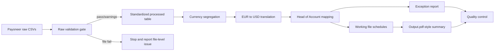

# Orchestration Reference

## Goal

Coordinate the Payoneer automation workflow across raw CSV intake, validation, processing, workbook generation, PDF-style final output, and exception reporting.

## Scope

Use this orchestration when the user asks to plan, build, audit, or document an end-to-end Payoneer automation. This reference does not replace the business rules in `raw-data.md`, `process-stage.md`, or `outputs.md`.

## Skill Inventory

| Skill | Trigger | Inputs | Outputs |
|---|---|---|---|
| `payoneer-automation` | Payoneer CSV automation, SOP, process flow, output summary | Payoneer USD/EUR raw CSVs, process flow, output PDF/workbook, mapping rules | Business workflow, schema, process rules, output requirements |
| `xlsx` / `spreadsheets` | Create, edit, analyze, or verify Excel/CSV workbooks | Raw CSVs, processed tables, templates, mappings | Working file, summary workbook, validation sheets |
| `pdf` | Read, extract, compare, or create PDF outputs | `Output.pdf`, rendered workbook PDFs | PDF text/table extraction, PDF final output checks |
| `skill-orchestration-planner` | Multi-skill catalog, pipeline, handoff planning | Skill folders, `SKILL.md`, catalog notes | `skills-catalog.md`, `orchestration_plan.md` |

## Execution Graph



## Handoffs

| From | To | Artifact / Schema |
|---|---|---|
| Raw intake | Validation | Original CSV rows plus `Source File`, `Raw Row Number` |
| Validation | Standardization | Valid rows plus flagged rows and file-level validation log |
| Standardization | Processing | Standard date/time, numeric amount fields, clean source/target/description |
| Processing | Classification | `Reporting Period`, `Net Amount`, `USD Equivalent Amount`, transaction type |
| Classification | Working file | `Head of Account`, section, month, source, USD-equivalent amount |
| Working file | Output summary | Period-by-period Head of Account totals |
| All stages | Exception report | Row identifiers, issue type, include/exclude status, review status |

## Validation Gates

File-level gate:

```text
CSV readable
Required Payoneer headers present
Currency column usable
No blocking schema corruption
```

Row-level gate:

```text
Transaction ID present and unique
Transaction Date valid
Debit/Credit amount logic valid
Status acceptable
Source and Target present
EUR translation possible when Currency = EUR
Head of Account mapped or row flagged
```

Output gate:

```text
Working schedules generated
Exception report generated
Output summary period columns match selected reporting months
Totals tie across working and summary outputs
No formula errors or unintended external links
PDF-style layout matches the reliable Output.pdf reference
```

## Failure Modes And Fallbacks

- Missing required headers: stop file processing; report missing headers.
- Duplicate `Transaction ID`: flag duplicates; exclude duplicates unless the user instructs otherwise.
- Invalid amount/date: flag row; exclude from summary until reviewed.
- Unmapped vendor/head: include under `Unclassified` or exclude based on user preference; always flag.
- Missing EUR rate: use fixed `1.18` unless user overrides; flag rate assumption.
- Corrupted workbook reference: prefer PDF view and regenerated self-contained workbook/PDF.
- PDF extraction ambiguity: use visual/PDF as layout guide, not as the calculation source.

## Open Decisions To Confirm Before Build

```text
Should unmatched rows be included under Unclassified or excluded?
Should the final output be PDF only, Excel plus PDF, or both?
Should source/cardholder appear in the final output or only in working support?
Should the fixed EUR-to-USD rate remain 1.18 for all periods?
Should manual non-Payoneer rows be imported from config or entered in template?
```
